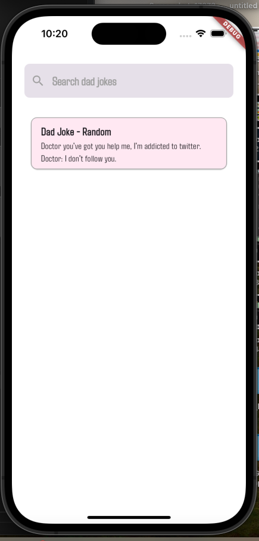
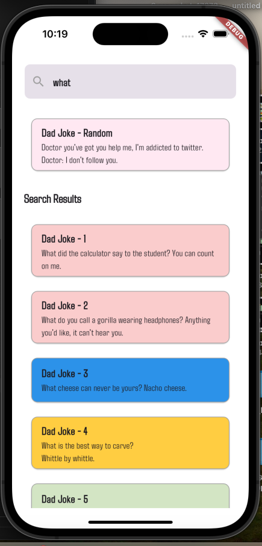

# degreed
A Flutter Assignment

## Assignment 

Create an application that uses the "I can haz dad joke" API (https://icanhazdadjoke.com/api) to display jokes. 
The graphic design of the application should prioritize simplicity, legibility, consistency, and adherence to overall 
design best practices according to your chosen platform. The application can be developed as a native iOS app, 
a native Android app, or a Flutter app. Use industry-standard best practices for retrieving, storing, and displaying joke results
from the API.

Upon startup, the application should fetch and display a random joke. 
The application should accept a search term, then display the jokes as a theoretically infinite scrolling list 
limited by the results of the API (no paging limits in the application itself).

## Completed Project Decription

# How To Run

- should have flutter installed on the system you are running the code
- go to main root folder and run 
- flutter pub get 
- flutter run -d <deviceId>

# Dependencies used for the project

- flutter_bloc
- get_it
- http
- dartz
- connectivity_plus

# Architecture and Designs Followed

- Clean Architecture (DATA - DOMAIN - PRESENTATION)
- Atomic Design
- Repository Pattern

# How the assignment looks - see below video

<table><tr>
## Assignment Journey :
  <td>main_screen.png</td>
  <td>search_results.png</td>
</tr>
  <td></td>
  <td></td>
</tr>
</table>
<table><tr>